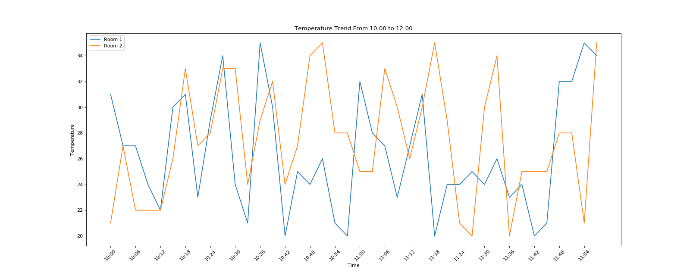
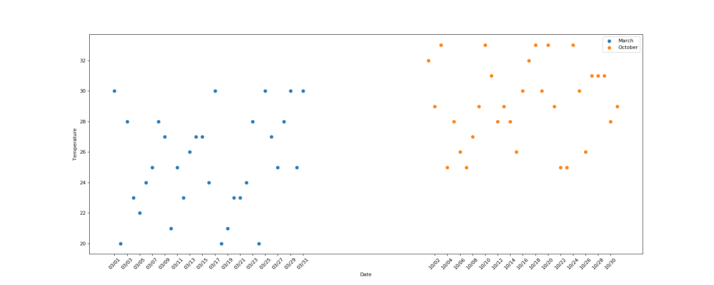
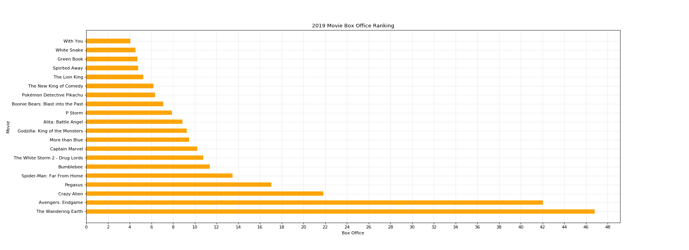
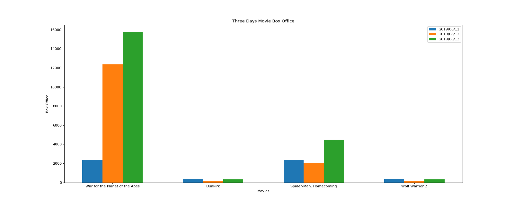

# Visualization
Use Python library `Matplotlib` to implement some data visualization.
## Temperature Trend
`y1` and `y2` represent the temperature of room1 and room2 from 10:00 to 12:00, respectively, and draw a line chart to observe the change of temperature.

Relevant code [here](./TemperatureChange/Plot.py).
```
y1 = [random.randint(20, 35) for i in range(0, 120, 3)]
y2 = [random.randint(20, 35) for i in range(0, 120, 3)]
```

## Weather Scatter
Draw a scatter plot of the temperature distribution in March and October.

Relevant code [here](./Weather/Scatter.py).

## 2019 Movie Box Office
Use `Matplotlib` to draw bar charts to visualize 2019 movie box office data.

Relevant code [here](./Movies/Bar1.py).

## Three Days Movies Box Office
Draw multiple bar charts to show box office information for several movies in three days.

Relevant code [here](./Movies2/Bar.py).
