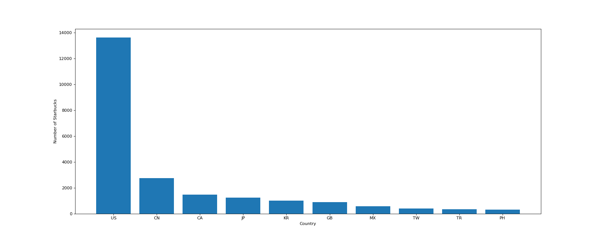

# Visualization
Use Python library `Matplotlib`, `Numpy` and `Pandas` to implement some data visualization.
## Temperature Trend
`y1` and `y2` represent the temperature of room1 and room2 from 10:00 to 12:00, respectively, and draw a line chart to observe the change of temperature.

Relevant code [here](./TemperatureChange/Plot.py).
```
y1 = [random.randint(20, 35) for i in range(0, 120, 3)]
y2 = [random.randint(20, 35) for i in range(0, 120, 3)]
```

## Weather Scatter
Draw a scatter plot of the temperature distribution in March and October.

Relevant code [here](./Weather/Scatter.py).

## 2019 Movie Box Office
Use `Matplotlib` to draw bar charts to visualize 2019 movie box office data.

Relevant code [here](./Movies/Bar1.py).

## Three Days Movies Box Office
Draw multiple bar charts to show box office information for several movies in three days.

Relevant code [here](./Movies2/Bar.py).

## Movies Duration Distribution 
Draw a histogram to analyze the distribution of the duration of 1000 movies.

Relevant code [here](./MovieDuration/Hist.py).

## IMDB
Use the two Python libraries `numpy` and `pandas` to analyze the distribution of movie types in the 1,000 movies of IMDB.

Relevant code [here](./IMDB/IMDB.py).


Analyze the distribution of movie durations in the IMBD movie list.

Relevant code [here](./IMDB/IMBD2.py).


## Starbucks
Use the method `groupby` in the `pandas` library to count the number of Starbucks in each country.

Relevant code [here](./Starbucks/chart1.py).


Count the number of Starbucks in the major cities of the United States.

Relevant code [here](./Starbucks/chart2.py).

## Books
The annual average rating change trend of books.

Relevant code [here](./Books/chart.py).

## Emergency (911) Calls
Csv [file](./911/911.csv) description: Fire, Traffic, EMS for Montgomery County, PA 

Analyze the total number of calls for three types of emergency calls.

Relevant code [here](./911/chart.py).


Analyze the changes in the number of calls for emergency calls per month.

Relevant code [here](./911/chart2.py).


Analyze the changes in the number of calls for three types of emergency calls per month.

Relevant code [here](./911/chart3.py).

.
## PM 2.5
**Context**

PM2.5 readings are often included in air quality reports from environmental authorities and companies. PM2.5 refers to atmospheric particulate matter (PM) that have a diameter less than 2.5 micrometers. In other words, it's used as a measure of pollution.

**[Content](./PM25/pm25/BeijingPM20100101_20151231.csv)**

The time period for this data is between Jan 1st, 2010 to Dec 31st, 2015. Missing data are denoted as NA.

* No: row number
* year: year of data in this row
* month: month of data in this row
* day: day of data in this row
* hour: hour of data in this row
* season: season of data in this row
* PM: PM2.5 concentration (ug/m^3)
* DEWP: Dew Point (Celsius Degree)
* TEMP: Temperature (Celsius Degree)
* HUMI: Humidity (%)
* PRES: Pressure (hPa)
* cbwd: Combined wind direction
* Iws: Cumulated wind speed (m/s)
* precipitation: hourly precipitation (mm)
* Iprec: Cumulated precipitation (mm)

**purposes**

Analyze the average PM2.5 change in Beijing every month.

Key point: **PeriodIndex** and relevant code [here](./PM25/chart.py).

